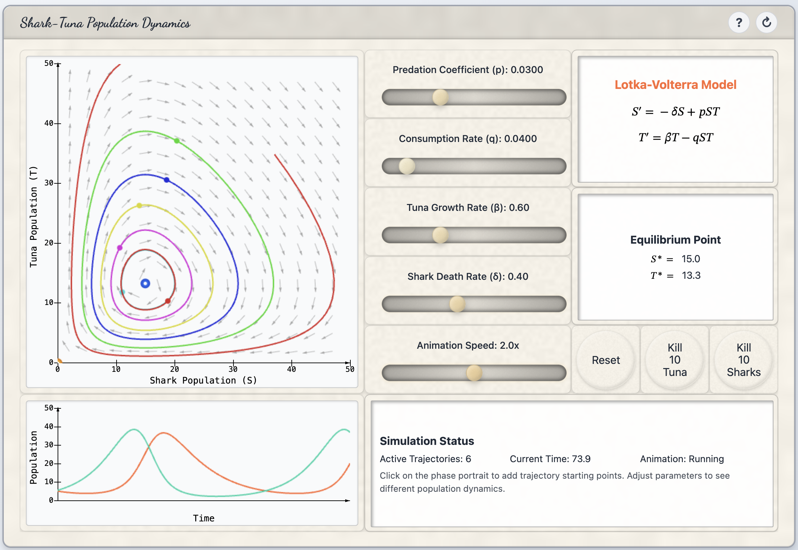

# Modeling Synthesizer

[](https://opensource.org/licenses/MIT)
[](https://martyweissman.github.io/modeling-synthesizer/)

**Interactive simulations for mathematical biology education**

A free, open-source collection of browser-based tools for exploring dynamical systems, differential equations, and mathematical models in the life sciences.

## [Launch the Modeling Synthesizer](https://martyweissman.github.io/modeling-synthesizer/)



## What is this?

The Modeling Synthesizer provides interactive simulations that help students visualize and understand mathematical concepts in biology. Each tool features real-time parameter adjustment, animated visualizations, and immediate feedback.

These tools are designed for undergraduate courses in mathematical biology, dynamical systems, and quantitative life sciences.

## Available Tools

### Ecology & Population Dynamics
- **Shark-Tuna Trajectories** - Phase space visualization of Lotka-Volterra predator-prey dynamics
- **Holling-Tanner Model** - Advanced predator-prey with Type II functional response
- **Logistic Growth Explorer** - Carrying capacity and S-curve population dynamics
- **Generalized Lotka-Volterra** - Two-species competition and mutualism
- **Discrete Logistic Explorer** - Period doubling, bifurcations, and chaos
- **Hutchinson Growth** - Time-delayed population dynamics

### Physiology & Pharmacokinetics
- **Insulin-Glucose Regulation** - Homeostasis and feedback control with meal challenges
- **Caffeine Metabolism** - Exponential decay with multiple daily doses
- **Gentamicin Dosage** - Therapeutic ranges and toxicity thresholds
- **Muscle Tremor Simulator** - Delay differential equations in neural control
- **FitzHugh-Nagumo Neuron** - Action potential dynamics and excitability

### Biochemistry & Biophysics
- **Higgins-Sel'kov Glycolysis** - Metabolic oscillations with nullclines and vector fields
- **Brownian Motion Simulator** - Random particle diffusion with Einstein-Stokes equation

### Mathematical Tools
- **Dynamical Systems Calculator** - Custom differential equations with vector fields
- **1D Dynamical System Calculator** - Phase line analysis and stability
- **Linear Regression with Log Scaling** - Data visualization and fitting
- **Rapid Coin Flipper** - Probability, random walks, and statistics

### Study Aides
- **Discrete Modeling Practice** - Randomized practice problems for difference equations
- **Trajectory & Time Series Practice** - Understanding phase portraits vs. time series

## Features

- **Real-time visualization** - See how changing parameters affects system behavior instantly
- **Phase portraits** - Vector fields, nullclines, and trajectory plotting
- **Time series plots** - Watch variables evolve over time
- **No installation required** - Runs entirely in your web browser
- **NOT YET Mobile friendly** - Meant for desktops and laptops.  May work on tablets.  Not recommended for phones and other low-resolution devices.
- **Dark mode** - Easy on the eyes for late-night studying
- **Help system** - Built-in documentation for each tool

## For Educators

These tools are free to use in your courses. Each simulation is designed to support specific learning objectives:

- **Visualizing abstract concepts** - Students can see what differential equations "do"
- **Parameter exploration** - Discover how parameters affect stability, oscillations, and equilibria
- **Building intuition** - Develop qualitative understanding before formal analysis
- **Active learning** - Interactive exploration during lectures or labs

Direct links to specific tools can be shared with students:
```
https://martyweissman.github.io/modeling-synthesizer/?tool=insulin-glucose
https://martyweissman.github.io/modeling-synthesizer/?tool=shark-tuna-trajectory
```

## Contributing

Interested in contributing or running the project locally? See [CONTRIBUTING.md](CONTRIBUTING.md) for development setup and guidelines.

## License

This project is open source and free for educational use.

## Author

Created by Martin Weissman for undergraduate mathematical biology education.
